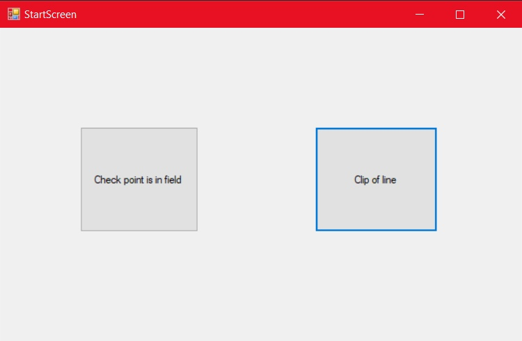
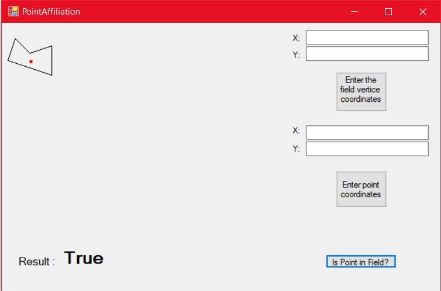
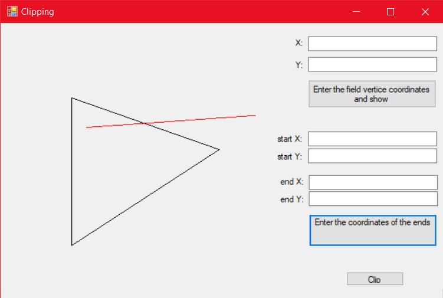
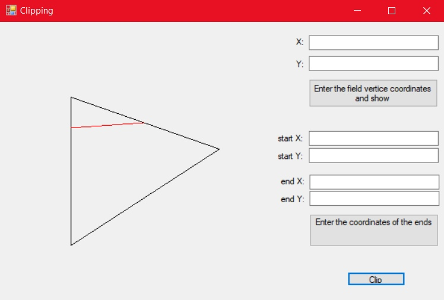

# DozeField

Данная программа предоставляет следующие возможности:  
1. Определить, находится ли заданная точка внутри этого многоугольника.
2. Для прямой, заданной двумя точками, отобразить (цветом) отрезки, лежащие внутри многоугольника.

*Инструменты реализации*

Для реализации программы был использован язык программирования C# . Также был использован WinForms.

Для первого пункта задачи был использован алгоритм "ближняя точка и ее нормаль" (https://habr.com/ru/post/301102/ (Метод 2)). 

Для второго пункта задачи был использован алгоритм проверки отрезков , полученных путем разбиения прямой сторонами многоугольника и последовательной проверки отрезков на принадлежность.

*Интерфейс*

Пользователю предоставляется простой интерфейс для проверки алгоритмов

1)Первая кнопка открывает алгоритм принадлежности точки многоугольнику 

В правом верхнем углу находятся поля для ввода координат поля. Координаты поля нужно вводить строго по часовой стрелке!
После ввода каждой координаты пользователь нажимает на кнопку ввода и слева видит как появляется его многоугольник 
Также ниже пользователь вводит координаты точки и ,нажав на "Is point in field?" может проверить лежит ли точка в многоугольнике или нет.
Результат отображается в левом нижнем углу(соответственно true или false)

2)Нажав на вторую кнопку на стартовом окне,пользователь открывает алгоритм отсечения отрезка 

 Координаты вводятся аналогично
Нажав на кнопку Clip пользователь видит отсечение отрезка

